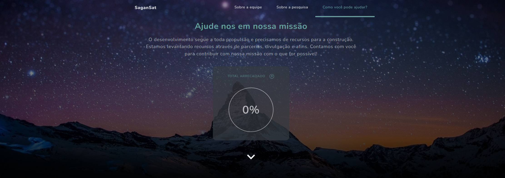

<h1 align="center">
  SaganSat-EA
</h1>

<p align="center">
  <a href="#description">Description</a>&nbsp;&nbsp;&nbsp;|&nbsp;&nbsp;&nbsp;
  <a href="#demonstration">Demonstration</a>&nbsp;&nbsp;&nbsp;|&nbsp;&nbsp;&nbsp;
  <a href="#requirements">Requirements</a>&nbsp;&nbsp;&nbsp;|&nbsp;&nbsp;&nbsp;
  <a href="#technologies">Technologies</a>&nbsp;&nbsp;&nbsp;|&nbsp;&nbsp;&nbsp;
  <a href="#usage">Usage</a></a>
</p>
<br />
<p align="center">
  
  
  
  
  
  
  
</p>

<p align="center">
  <a href="https://github.com/Lissone/SaganSat-website/issues">Report bug</a>
  ·
  <a href="https://github.com/Lissone/SaganSat-website/issues">Request feature</a>
</p>

<br />

## Description

This project is a website with the aim of creating support contacts to be able to create a nano satellite. 

For more information about the project: https://github.com/SaganSat-EA

## Demonstration



## Requirements

- [Npm](https://www.npmjs.com/)
- [Yarn](https://yarnpkg.com/)
- [Nodejs](https://nodejs.org/en/)

## Technologies

- React
- NextJs
- Typescript
- StyledComponents
- EmailJs

## Usage

You can clone it on your pc using the command:

```bash
git clone https://github.com/Lissone/SaganSat-website.git
cd SaganSat-website
```

Install dependencies using:

```bash
yarn
#or
npm install
```

Need to add environment variables:

```bash
# .\.env.local

# EMAILJS
NEXT_PUBLIC_EMAILJS_SERVICE_ID=
NEXT_PUBLIC_EMAILJS_TEMPLATE_ID=
NEXT_PUBLIC_EMAILJS_PUBLIC_KEY=
```

Run web:

```bash
yarn dev
#or
npm run dev
```

## License

Distributed under the MIT License. See `LICENSE` for more information.

<h4 align="center">
  Made with ❤️ by <a href="https://github.com/Lissone" target="_blank">Lissone</a>
</h4>

<hr />